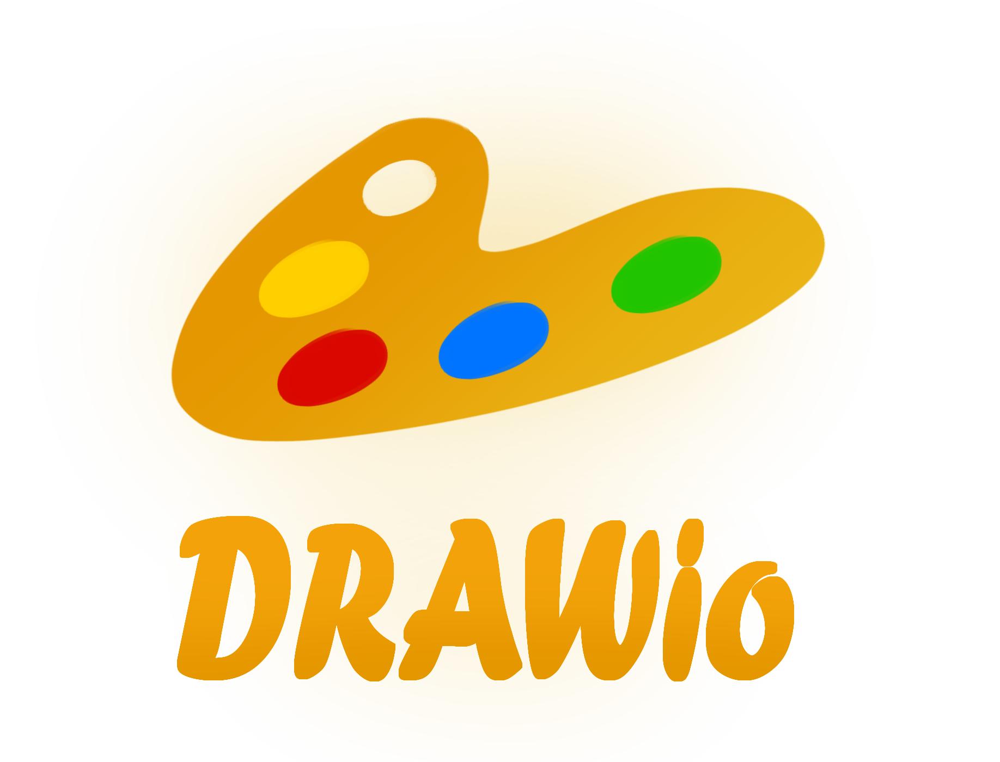
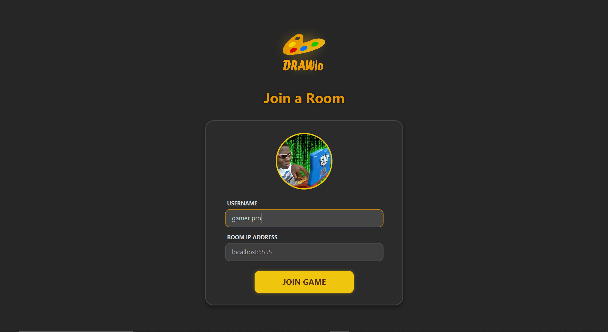
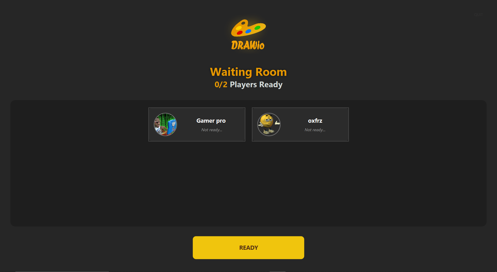
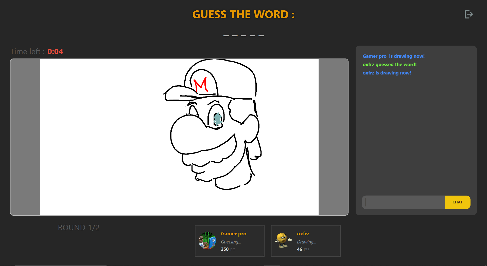
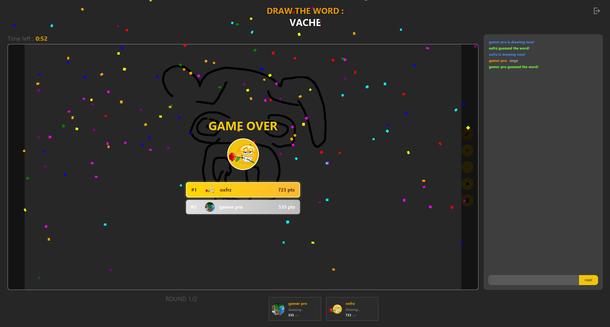

# 🎨 Drawio - Multiplayer Drawing Game

<div align="center">
  

  <h1 align="center">Drawio</h1>

  <p align="center">
    <strong>A modern reimplementation of Skribbl.io developed in Java 21 and JavaFX</strong>
    <br />
    <br />
    <a href="#-installation--setup"><strong>Installation »</strong></a>
    ·
    <a href="#-gallery--screenshots"><strong>Screenshots »</strong></a>
    ·
    <a href="#-troubleshooting"><strong>Support »</strong></a>
  </p>
</div>

**Drawio** is a modern clone of the famous drawing and guessing game "Skribbl.io", built with **Java 21** and **JavaFX**.

The game relies on a robust **Server-Authoritative** architecture using TCP sockets, enabling real-time multiplayer matches with drawing synchronization, live chat, and a lobby system.

---

## ✨ Features

* **🎨 Real-time Drawing:** Brush, eraser, color picker, and adjustable stroke size. Synchronization is fluid across all clients.
* **🕹️ Complete Gameplay:**
    * **Lobby System** (Waiting Room) with "Ready" status and player counter.
    * Custom avatar selection from the disk via the connection screen.
    * Word selection (3 choices) for the drawer.
    * Automatic answer detection in the chat.
    * Round timer and dynamic score calculation.
* **🏆 Immersive End Game:** Leaderboard (Gold/Silver/Bronze medals) and confetti animation for the winner.
* **💬 Integrated Chat:** Discussion between players and system announcements (connections, turns, victories).
* **🔊 Audio Atmosphere:** Sound effects for events (victory, defeat, time up, messages).

---

## 📸 Gallery & Screenshots

### Connection & Avatar

*Connection screen with custom avatar upload*

<br>

### Waiting Lobby

*Waiting room with player statuses*

<br>

### In-Game (Drawing & Guessing)

*Main game interface with drawing canvas and chat*

<br>

### Game Over

*Final podium with results and confetti*

---

## 🛠️ Tech Stack

* **Language:** Java 21
* **GUI:** JavaFX 21 (FXML + Modular CSS)
* **Build System:** Gradle (Kotlin DSL)
* **Network:** Java Sockets (TCP)
* **Distribution:** `jlink` plugin to generate lightweight standalone executables.

---

## 🚀 Installation & Setup

### Prerequisites
* Windows, Linux, or macOS.
* **(Optional)** JDK 21 installed if you want to develop (the `jlink` build includes its own runtime).

### 1. Clone the project
@@@bash
git clone [https://github.com/votre-compte/projects7-skribbl.git](https://github.com/votre-compte/projects7-skribbl.git)
cd projects7-skribbl
@@@

### 2. Compile the project (Generate Executables)

The project uses **Gradle** with the **JLink** plugin to create portable versions of the client and server.

**On Windows (PowerShell):**
```powershell
$env:JAVA_HOME="C:\Program Files\Java\jdk-21"; .\gradlew jlinkZip
```

**On Linux / macOS:**
```bash
chmod +x gradlew
JAVA_HOME=/usr/lib/jvm/java-21-openjdk ./gradlew jlinkZip
```

### 3. Run Server and Client

Once the compilation is complete, go to the distribution folder:
`build/distributions/`

Unzip the `.zip` file. In the extracted `bin` folder, you will find two launchers:

1.  **Start the Server:**
    * Windows: Double-click `SkribblServer.bat`
    * Linux/Mac: `./SkribblServer`
2.  **Start the Client:**
    * Windows: Double-click `SkribblClient.bat`
    * Linux/Mac: `./SkribblClient`

---

## 📂 Project Structure

```
src/main/java/fr/polytech/wid/s7projectskribbl
├── client               # Client Side (JavaFX)
│   ├── actions          # Packet reception logic (Command Pattern)
│   ├── controller       # FXML Controllers (GameController, JoinRoom...)
│   ├── network          # Client Socket Management
│   ├── service          # Managers (SoundManager, PopupService...)
│   └── Launcher.java    # Client Entry Point
├── server               # Server Side
│   ├── client           # Connected Client Management
│   ├── room             # Game Logic (GameLoop)
│   └── Main.java        # Server Entry Point
└── common               # Shared Code (Payloads, Constants)
```

---

## 🐛 Troubleshooting

**Game doesn't start on Windows (SmartScreen)?**
Windows might block unsigned `.bat` files.
1.  Right-click the generated ZIP file -> **Properties**.
2.  Check **"Unblock"** at the bottom.
3.  Apply, then unzip again.

**Sound issues on Linux?**
Ensure you have the necessary libraries installed:
`sudo pacman -S ffmpeg gst-libav` (Arch) or `sudo apt install libasound2 ffmpeg` (Ubuntu).

---

## 👥 Authors

This project was created as part of the Polytech curriculum.

* **Dalil NAAMNA**
* **Wassim HAMRIT**
* **Ibrahim OZEL**